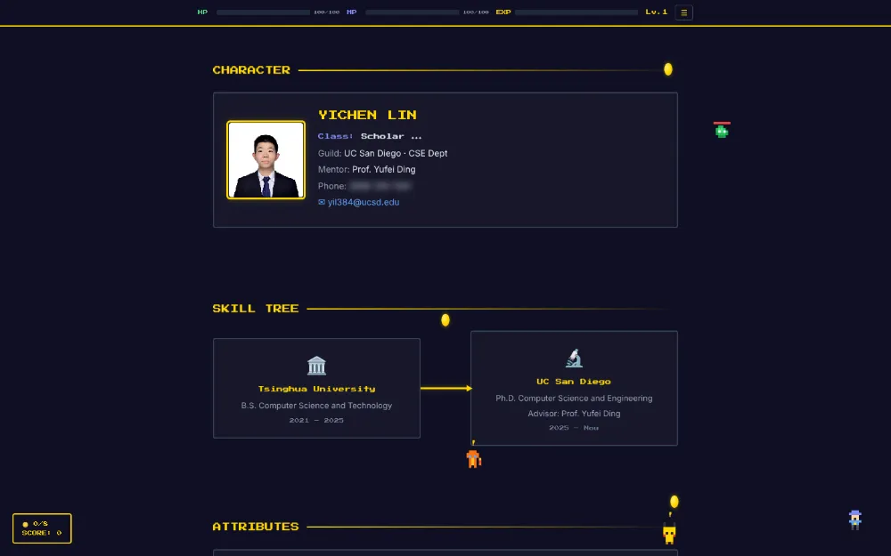
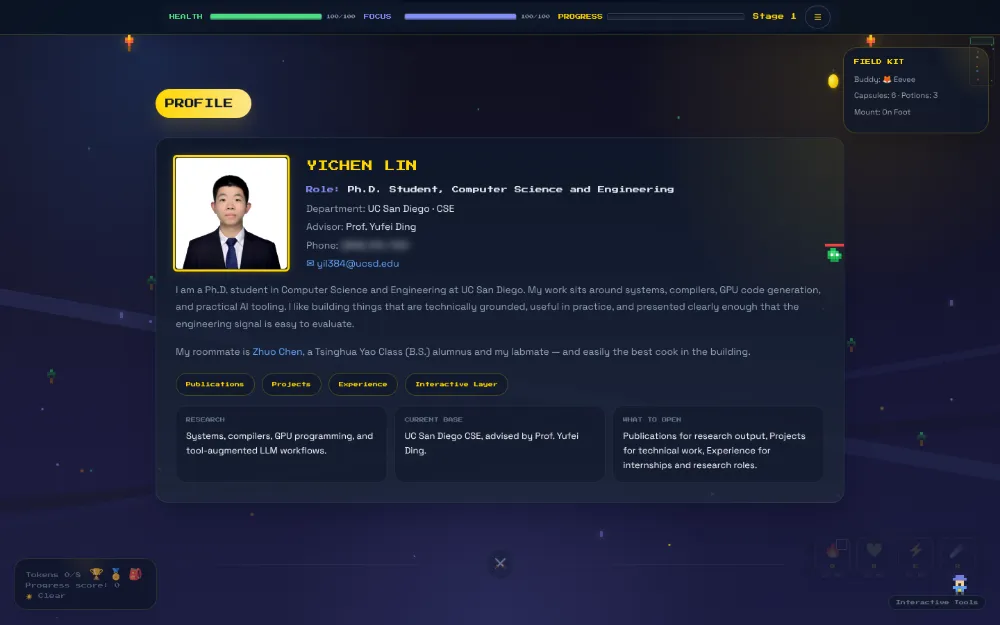
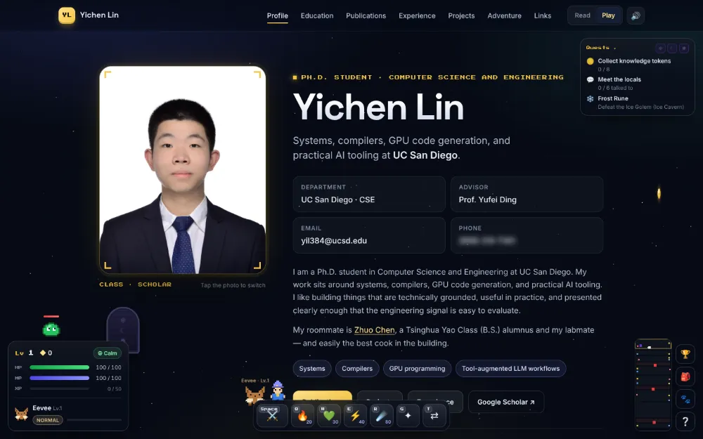
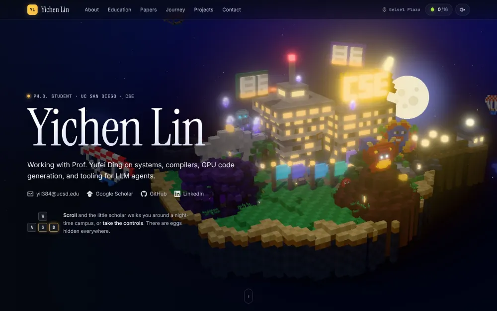
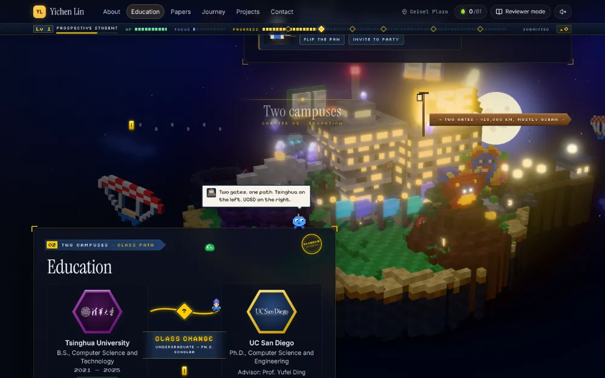
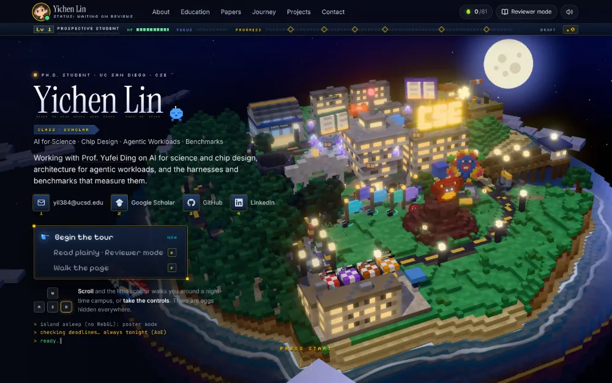
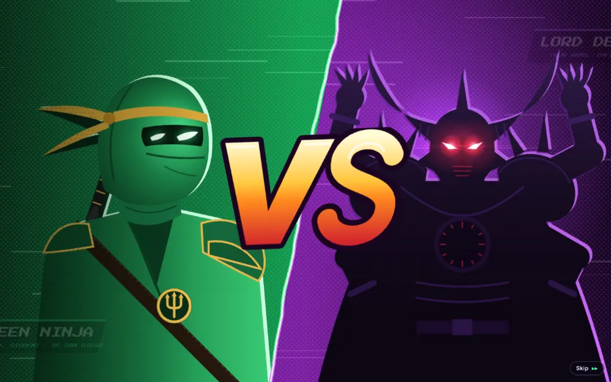

# yil384.github.io

Personal homepage of Yichen Lin (Ph.D. student, UC San Diego CSE).

The page **is** a small night-time UC San Diego. A three.js voxel island is always rendered behind the
page; the CV sections are glass panels floating over it. Scrolling walks a little scholar between
landmarks (Geisel Library, the CSE building, the Tsinghua gate, a trail of flags, a workshop with four
monuments, the Sun God lawn and a Scripps-style pier). Press <kbd>W A S D</kbd> at any time to take the
controls and play the full game; <kbd>Esc</kbd> returns to the page. There are a lot of easter eggs
(the counter in the top bar keeps score; the backtick key opens a terminal).

The CV itself is game UI (`assets/js/site/ui/`, `assets/css/ui/`): a title screen, a party sheet (About),
a class-change path (Education), an achievements hall (Publications), a quest log (Experience),
equipment cards (Projects), attribute bars (Skills), portals and a save point (Contact) and a credits roll.
An RPG status strip (level, HP, focus, progress, Triton Cash) rides under the bar; Bit and harmless
critters live on the cards; <kbd>P</kbd> lets the scholar walk and jump across the page. Every fact stays plain
HTML: <kbd>R</kbd> (or `?plain=1`) switches to Reviewer mode, a calm one-column CV, which is also what print
and no-JS get. <kbd>?</kbd> lists the keys.

Plain HTML/CSS and native ES modules, no build step. three.js r186 (WebGPU with a WebGL2 fallback).
Devices without a usable GPU, `prefers-reduced-motion` and `?world=0` keep the baked poster behind a
fully working page.

```
index.html                     the page (all CV content lives here, as plain HTML)
assets/css/site.css            page styles: glass cards, top bar, hero, responsive, print
assets/css/game.css            world labels, speech bubbles, play-mode HUD and dialogs
assets/js/page.js              boot: chrome first, then the world if the device can run it
assets/js/site/                page-side scripts
  chrome.js                    top bar (zone, progress, nav, sound, play), card reveals, scroll spy
  eggs.js                      easter-egg registry, persistence, toasts
  eggs-dom.js                  page-level eggs (Konami, portrait, name, tab-away, bottom, print, console)
  portrait-flip.js             double-click the photo: it flips over and plays assets/video/intro.*
  notes.js                     the Field Notes panel
  terminal.js                  the backtick terminal
assets/js/game3d/              the world
  index.js                     runtime: one renderer, tour mode and play mode
  stage.js                     landmarks, sky, anchors, camera shots, highlights (the "set")
  layout.js                    where everything stands; terrain is levelled under the plots
  landmarks.js  props.js       voxel builders (tower, CSE, gate, flags, monuments, pier, ...)
  sky.js                       gradient dome, stars, moon, clouds, shooting stars
  camera.js                    one damped camera: authored shots (tour) or follow (play)
  director.js                  page <-> world: scroll picks the shot, hover/click links both ways
  tour.js                      the scholar walking to wherever the page points
  eggs3d.js                    world-level eggs
  dossier.js                   islanders open the real CV sections in a game window
  ...                          the game systems (combat, companions, bosses, NPCs, mini-games)
assets/js/three/               pixel-art definitions, voxel extrusion, renderer bootstrap, GPU probe
assets/vendor/three/           three.js (MIT), minified builds + the addons used
assets/img/world-poster.jpg    baked hero frame (fallback + first paint), og.jpg share image
```

## How it got here

From a one-column CV to a 2D pixel RPG to a 3D voxel campus. Each picture is that commit's first screen at
1440×900, rendered straight from git (`node tools/dev/history.mjs`, phone number blurred); the commit link
browses the code as it was. The current version is live at <https://yil384.github.io/>.

<table>
<tr>
<td width="50%" valign="top"><br>
<b>2025-10-23</b> · A plain academic page: one column of cards for education, publications and internships.
<a href="https://github.com/yil384/yil384.github.io/tree/725582b"><code>725582b</code></a></td>
<td width="50%" valign="top"><br>
<b>2026-03-25</b> · A 2D pixel RPG: the CV as a character sheet, skill tree, quests and equipment, with coins,
NPCs, enemies and a boss fight. <a href="https://github.com/yil384/yil384.github.io/tree/0bd5056"><code>0bd5056</code></a></td>
</tr>
<tr>
<td valign="top"><br>
<b>2026-04 → 06</b> · A bigger 2D game: title screen, parallax world, minimap, mini-games and bosses that come
back stronger, restyled as a monster-trainer world. <a href="https://github.com/yil384/yil384.github.io/tree/eac566e"><code>eac566e</code></a></td>
<td valign="top"><br>
<b>2026-09-28</b> · A modular rebuild, still 2D: a profile page with a Read / Play switch, quests and a buddy
that fights beside you. The last 2D version. <a href="https://github.com/yil384/yil384.github.io/tree/5032046"><code>5032046</code></a></td>
</tr>
<tr>
<td valign="top"><br>
<b>2026-09-29</b> · The first 3D version: a quiet academic page, with a separate three.js island game.
<a href="https://github.com/yil384/yil384.github.io/tree/131b0d7"><code>131b0d7</code></a></td>
<td valign="top"><br>
<b>2026-09-30</b> · The island moves behind the page: one persistent world, the CV on glass cards, and
scrolling walks a little scholar around campus. <a href="https://github.com/yil384/yil384.github.io/tree/bc69f34"><code>bc69f34</code></a></td>
</tr>
<tr>
<td valign="top"><br>
<b>2026-09-30</b> · The CV becomes game UI (status strip, tour menu, Education as a class-change path), and the
open world gets its regions the same day. <a href="https://github.com/yil384/yil384.github.io/tree/53442b3"><code>53442b3</code></a></td>
<td valign="top"><br>
<b>2026-09-30</b> · The island grows 2.6× into a round diorama in a moving sea; a visitor map joins the footer.
Then a comic ninja video behind a double-click on the photo (10-01, <a href="https://github.com/yil384/yil384.github.io/tree/7476cfe"><code>7476cfe</code></a>) and a LEGO
portrait built brick by brick (10-03, <a href="https://github.com/yil384/yil384.github.io/tree/c4bd429"><code>c4bd429</code></a>). <a href="https://github.com/yil384/yil384.github.io/tree/27d9288"><code>27d9288</code></a></td>
</tr>
<tr>
<td valign="top"><br>
<b>2026-10-07</b> · An opening animation: a short ninja battle over a UCSD / ninja-city skyline that shatters
like glass into the page, with characters drawn in code. <a href="https://github.com/yil384/yil384.github.io/tree/8ca467c"><code>8ca467c</code></a></td>
<td valign="top"><br>
<b>2026-10-08</b> · The same opening with LEGO Ninjago art, and 林奕辰 beside the name.
<a href="https://github.com/yil384/yil384.github.io/tree/f21bb39"><code>f21bb39</code></a></td>
</tr>
</table>

## How the page drives the world

Markup carries the choreography; no JavaScript needs editing to change what is said or where the
camera goes for a section:

| attribute | on | meaning |
| --- | --- | --- |
| `data-shot="hero"` | `<section>` | camera shot (a key in `stage.js` → `shots`) while the section is centred |
| `data-side="left\|right"` | `<section>` | which side the card sits on; the world shifts to the other |
| `data-zone="Geisel Plaza"` | `<section>` | name shown in the top bar |
| `data-focus="mon-oj"` | card / row | finer shot and landmark highlight while that row is centred or hovered |
| `data-say="nell: Two shelves so far."` | section / card | an islander (`nell`, `ash`, `unit7`, `fern`, `me`, `bit`) says it |

Unknown `data-focus` keys fall back to the section's shot, so new rows work without touching the world.
Hovering a landmark lights up its card and clicking it scrolls to the card; hovering a card lights the
landmark. Clicking the ground sends the scholar there.

## URL switches (for testing)

`?world=0` no 3D · `?force=1` run on software GPUs · `?lowfx=1` no shadows/bloom · `?fullfx=1` force them
on · `?dpr=1` fixed pixel ratio (disables adaptive resolution) · `?intro=0` skip the opening fly-in ·
`?play=1` start in play mode.

Run locally with any static server, e.g. `python3 -m http.server 8000`.

## Credits

Logos belong to their organisations (shown for identification). Icons: Simple Icons (CC0), Lucide (ISC),
game-icons.net (CC BY 3.0). Not affiliated with UC San Diego or Tsinghua University; the campus is a
fond, wonky tribute.
